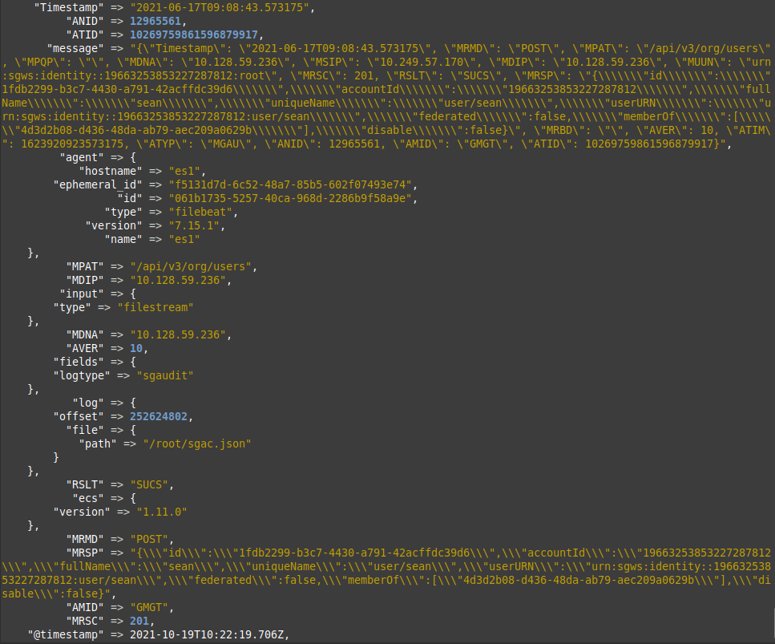
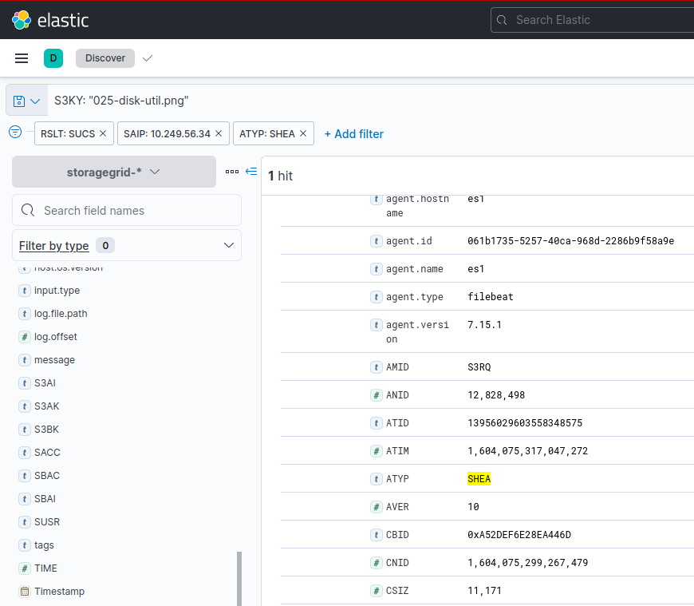

# StorageGRID Audit-log Converter (SGAC)

<!-- TOC -->

- [StorageGRID Audit-log Converter SGAC](#storagegrid-audit-log-converter-sgac)
    - [Run sgac.py and view its output](#run-sgacpy-and-view-its-output)
        - [What to do with SGAC output](#what-to-do-with-sgac-output)
        - [SGAC performance](#sgac-performance)
    - [Additional information about StorageGRID audit log](#additional-information-about-storagegrid-audit-log)
        - [How to get StorageGRID audit log](#how-to-get-storagegrid-audit-log)
        - [Accessing audit logs](#accessing-audit-logs)
        - [Sample StorageGRID audit log entry for S3 PUT](#sample-storagegrid-audit-log-entry-for-s3-put)
        - [How to read audit messages](#how-to-read-audit-messages)
        - [What if I'm just interested in S3 PUT/GET/DELETE to determine top users and such](#what-if-im-just-interested-in-s3-putgetdelete-to-determine-top-users-and-such)
        - [Is there a list of all fields/keys for StorageGRID logs](#is-there-a-list-of-all-fieldskeys-for-storagegrid-logs)
        - [How can one ensure that no audit log file is deleted before it's copied out of Admin Node](#how-can-one-ensure-that-no-audit-log-file-is-deleted-before-its-copied-out-of-admin-node)
        - [Sample audit-explain output](#sample-audit-explain-output)
        - [Sample audit-sum output](#sample-audit-sum-output)
    - [Known issues](#known-issues)
    - [Change Log](#change-log)

<!-- /TOC -->

## Run `sgac.py` and view its output

**NOTE:** users of StorageGRID 11.6 and above should check [audit log forwarding](https://scaleoutsean.github.io/2022/03/04/storagegrid-s3-select.html#storagegrid-log-forwarding) feature that appeared in 11.6. That link also explains why there's no SGAC for version 11.6 - you don't need to read and process logs - since 11.6 they can be [forwarded](https://docs.netapp.com/us-en/storagegrid-enable/tools-apps-guides/elk-instructions.html#instruction) to a syslog destination external to StorageGRID cluster.

Users of StorageGRID 11 (especially 11.0 to 11.5) can download StorageGRID 11 audit log file and convert it to JSON documents (one per event) like so:

```shell
./sgac.py /data/in/audit.log /data/out/sgac.json
```

SGAC saved audit log data to `/data/out/sgac.json`. View the file (formatted version shown for easier viewing):

```json
{
  "Timestamp": "2021-06-23T04:27:39.206920",
  "RSLT": "SUCS",
  "CNID": 1624422459190127,
  "TIME": 11138,
  "SAIP": "10.128.59.192",
  "TLIP": "10.128.59.241",
  "S3AI": "19663253853227287000",
  "SACC": "solidfire",
  "S3AK": "SGKHulDF8HGK7Az_xR02pVQgooThBQ_rE9dmuuLsLg==",
  "SUSR": "urn:sgws:identity::19663253853227287812:root",
  "SBAI": "19663253853227287000",
  "SBAC": "solidfire",
  "S3BK": "local",
  "S3SR": "policy",
  "SRCF": "{ \"Statement\": [ { \"Sid\": \"AllowEveryoneAccess\", \"Effect\": \"Allow\", \"Principal\": \"*\", \"Action\": [ \"s3:*\" ], \"Resource\":[ \"arn:aws:s3:::local\", \"arn:aws:s3:::local/*\" ] } ]}",
  "AVER": 10,
  "ATIM": 1624422459206920,
  "ATYP": "SPUT",
  "ANID": 12470893,
  "AMID": "S3RQ",
  "ATID": "17576182984180280000"
}
{
  "Timestamp": "2021-06-23T04:28:00.173006",
  "RSLT": "SUCS",
  "CNID": 1624422480164404,
  "TIME": 2529,
  "SAIP": "10.128.59.192",
  "TLIP": "10.128.59.241",
  "S3AI": "19663253853227287000",
  "SACC": "solidfire",
  "S3AK": "SGKHulDF8HGK7Az_xR02pVQgooThBQ_rE9dmuuLsLg==",
  "SUSR": "urn:sgws:identity::19663253853227287812:root",
  "SBAI": "19663253853227287000",
  "SBAC": "solidfire",
  "S3BK": "local",
  "S3SR": "policy",
  "AVER": 10,
  "ATIM": 1624422480173006,
  "ATYP": "SGET",
  "ANID": 12470893,
  "AMID": "S3RQ",
  "ATID": "7642530268470403000"
}
{
  "Timestamp": "2021-06-23T04:28:37.598880",
  "MRMD": "POST",
  "MPAT": "/api/v3/authorize",
  "MPQP": "",
  "MDNA": "10.128.59.236",
  "MSIP": "10.249.56.46",
  "MDIP": "10.128.59.236",
  "MUUN": "",
  "MRSC": 200,
  "RSLT": "SUCS",
  "MRSP": "",
  "MRBD": "{\"cookie\":true,\"csrfToken\":true,\"accountId\":\"19663253853227287812\",\"username\":\"root\",\"password\":\"********\"}",
  "AVER": 10,
  "ATIM": 1624422517598880,
  "ATYP": "MGAU",
  "ANID": 12965561,
  "AMID": "GMGT",
  "ATID": "10845975050772195000"
}
{
  "Timestamp": "2021-06-23T04:29:26.581992",
  "MRMD": "POST",
  "MPAT": "/api/v3/org/groups",
  "MPQP": "",
  "MDNA": "10.128.59.236",
  "MSIP": "10.249.56.46",
  "MDIP": "10.128.59.236",
  "MUUN": "urn:sgws:identity::19663253853227287812:root",
  "MRSC": 201,
  "RSLT": "SUCS",
  "MRSP": "{\"id\":\"3bf5ee06-8b21-4a35-8fd4-40efc0c7a63b\",\"accountId\":\"19663253853227287812\",\"displayName\":\"audittest\",\"uniqueName\":\"group/Just messing with SG for audit log testing\",\"groupURN\":\"urn:sgws:identity::19663253853227287812:group/Just messing with SG for audit log testing\",\"federated\":false,\"managementReadOnly\":false,\"policies\":{\"management\":{\"manageAllContainers\":true,\"manageEndpoints\":true,\"manageOwnS3Credentials\":true,\"rootAccess\":true},\"s3\":{\"Statement\":[{\"Effect\":\"Allow\",\"Action\":\"s3:*\",\"Resource\":\"urn:sgws:s3:::*\"}]}}}",
  "MRBD": "",
  "AVER": 10,
  "ATIM": 1624422566581992,
  "ATYP": "MGAU",
  "ANID": 12965561,
  "AMID": "GMGT",
  "ATID": "17919283269131872000"
}
```

### What to do with SGAC output

You may import it somewhere for the purpose of analytics, visualization and reporting.

Example: screenshot of Logstash processing SGAC JSON output and sending it to Elastic:



Example: finding successful downloads of an object from a specific IP address:



### SGAC performance

No tuning has been done whatsoever, because it hasn't been necessary.

sgac.py goes through audit log at 1.8 MB/s using one CPU core. This allows it to process a 2 GB audit log file in less than 20 minutes. If we were to split the input file, we could complete the job in less than 5 minutes.

## Additional information about StorageGRID audit log

### How to get StorageGRID audit log

Links in this section lead to the official NetApp StorageGRID documentation (v11.5, mostly) to avoid repeating what's already in the manual.

1. Get into the Admin Nodes (each one, if you want to not lose logs, so you want to be able to fetch them from either server) and enable NFS or SMB read-only shares of audit logs (see the StorageGRID documentation, such as [Configuring the audit client for NFS](https://docs.netapp.com/sgws-115/index.jsp?topic=%2Fcom.netapp.doc.sg-admin%2FGUID-B9B9FB7B-76FA-4C85-99A7-4310E3F24F1C.html&resultof=%22%61%75%64%69%74%22%20%22%63%6c%69%65%6e%74%22%20%22%6e%66%73%22%20%22%6e%66%22%20))
2. Fetch StorageGRID log file from Admin Node (container) (NFSv3: `sg-adm1:/var/local/audit/export`; SMB: `\\sg-adm1\...`)
3. Decompress log file(s) you've downloaded (.tar.gz); you should always download compressed audit log files because they don't change)
4. Run SGAC to convert the uncompressed log file(s) to JSON

### Accessing audit logs

The approach is simple - configure an Admin node (Primary, or Backup, or both) to export audit logs via a read-only NFSv3 share (see the StorageGRID documentation - you need to login to one of admin nodes, enter the StorageGRID container and run a Ruby based configuration utility).

Then from a secure client use `showmount -e $ADMIN-NODE-IP` to see the export name, and mount it.

Audit log files older than one day are compressed (see the documentation links about log rotation further below), while the current log file is not.

```raw
2021-06-18.txt.gz
2021-06-19.txt.gz
2021-06-20.txt.gz
2021-06-21.txt.gz
2021-06-22.txt.gz
audit.log
```

It isn't practical to "stream" logs from audit.log because that file can be large and you'd probably re-read it all the time (not recommended for Primary Admin node because of the potential to overload it).

It is recommended to copy compressed files from NFS shares and decompress and process them elsewhere.

### Sample StorageGRID audit log entry for S3 PUT

Line breaks were inserted for easier viewing:

```raw
2020-10-30T17:29:51.084346 [AUDT:
[RSLT(FC32):SUCS]
[CNID(UI64):1604078982714250]
[TIME(UI64):346407]
[SAIP(IPAD):"10.128.59.235"]
[TLIP(IPAD):"10.128.59.214"]
[S3AI(CSTR):"89182157694196817210"]
[SACC(CSTR):"sean_three"]
[S3AK(CSTR):"SGKHpuvjCd-ysEBx0MA0QYt6KeifUL3yPiHtp2R5xg=="]
[SUSR(CSTR):"urn:sgws:identity::89182157694196817210:user/seantwo-user2"]
[SBAI(CSTR):"89182157694196817210"]
[SBAC(CSTR):"sean_three"]
[S3BK(CSTR):"three003"]
[S3KY(CSTR):"testobject-7"]
[ULID(CSTR):"IXYD2VycKmrwS89IfRuAtNsB6JLxw7Z2wfjdT_bRT_qn-Ew2ppDeFbCPUA"]
[CBID(UI64):0x4090675BCE7E4050]
[UUID(CSTR):"FC2C5E4C-081A-42D0-8FAE-4C887B28894E"]
[CSIZ(UI64):320000000]
[AVER(UI32):10]
[ATIM(UI64):1604078991084346]
[ATYP(FC32):SPUT]
[ANID(UI32):12828498]
[AMID(FC32):S3RQ]
[ATID(UI64):7009770064519048249]
]
```

What's in it? With parameter type indicators removed:

- `TIMESTAMP` - ISO 8601 time
- `[RSLT:SUCS]` - Result.
- `[SAIP:"10.128.59.235"]` - Source IP Address (S3 Client); `HTRH`, if audit logs it, automatically includes `X-Forwarded-For` if present on the load balancer
- `[TLIP:"10.128.59.214"]` - Trusted Loadbalancer IP (Grid Network IP of StorageGrid GW VM, in this particular grid)
- `[S3AI:"89182157694196817210"]` - S3 (Tenant) Account ID (89182157694196817210)
- `[SACC:"sean_three"]` - S3 (Tenant) Account Name; empty for anonymous requestors
- `[SUSR:"urn:sgws:identity::89182157694196817210:user/seantwo-user2"]` - S3 Identity (Tenant ID 89182157694196817210 plus Full Name); empty for anonymous requests
- `[SBAC:"sean_three"]` - S3 Account Name
- `[S3BK:"three003"]` - S3 Bucket
- `[S3KY:"testobject-7"]` - S3 Key
- `[ATYP:SPUT]` - S3 PUT audit event type
- `[CSIZ:320000000]` - Content Size (bytes)

Links in here are links to the official StorageGRID documentation pages (v11.5 at the moment) to avoid repeating that info. Make sure you refer to the StorageGRID documentation for StorageGRID version you use.

### How to read audit messages

[Start with TFM](https://docs.netapp.com/sgws-115/index.jsp?topic=%2Fcom.netapp.doc.sg-audit%2FGUID-1FD2FE07-A18F-44FA-A3B3-C7860E739A72.html) for your version (the link is for 11.5).

### What if I'm just interested in S3 PUT/GET/DELETE to determine top users and such

Check out audit-explain, it may be sufficient for you. But with SGAC, you can add this in Python or (much easier) create such reports using Elastic or a database.

Some keys/fields of interest:

- SPUT - S3 PUT (bytes)
- SGET - S3 GET (bytes)
- SDEL - S3 DELETE
- SHEA - S3 HEAD
- SUPD - S3 Update (e.g. Metadata)
- CSIZ - Content Size (example for StorageGRID [S3 GET](https://docs.netapp.com/sgws-115/index.jsp?topic=%2Fcom.netapp.doc.sg-audit%2FGUID-223B2822-4053-4913-8B54-5D01E4186CC6.html))

If Cloud Tiering is enabled and used you'd have the following SGET-equivalent traffic:

- ASCT - Archive Store (Cloud Tier) - basically egress from StorageGRID (similar to SGET in terms of network cost)
- ARCT - Archive Retrieve (Cloud Tier) - basically ingress (similar to SPUT in terms of network cost)
- SPOS - S3 POST is used to restore object from AWS Glacier storage to a Cloud Storage Pool

There are also Swift entries but barely anyone uses it, so click on the audit-sum link above to see about Swift.

### Is there a list of all fields/keys for StorageGRID logs

See the official documentation. I'm not aware of any omissions.

### How can one ensure that no audit log file is deleted before it's copied out of Admin Node

- Admin Node requires [200 GB space for audit logs](https://docs.netapp.com/sgws-115/index.jsp?topic=%2Fcom.netapp.doc.sg-install-rhel%2FGUID-8A777F78-E21D-4E4F-AF1A-DBD432E6D030.html)
- Every day logs are [rotated and compressed](https://docs.netapp.com/sgws-115/index.jsp?topic=%2Fcom.netapp.doc.sg-audit%2FGUID-33B77138-D408-4D4F-9994-D2E8C3101FF2.html), so assuming 20 GB of log files per day, one has days to get the compressed log file out before it's deleted. The NetApp Support site has a KB about expanding the space for logs.
- You could use NetApp XCP to copy files to another share or CloudSync to copy them from NFS to S3 (yes, you *can* copy audit logs to a StorageGRID bucket, but that kind of defeats the purpose for certain things such as compliance)

### Sample audit-explain output

audit-explain is built into StorageGRID.

```raw
SPUT S3 PUT object cbid:CA681D278A779FEE uuid:2EC5D4B4-7266-4E16-8FDD-0881A496CEF2 tenant:93303750965081886661 client:10.249.56.126 load_balancer:10.128.59.214 bytes:32000 usec:23904  path:two-b2/testobject-995
SHEA S3 HEAD object cbid:CA681D278A779FEE uuid:2EC5D4B4-7266-4E16-8FDD-0881A496CEF2 tenant:93303750965081886661 client:10.249.56.126 load_balancer:10.128.59.214 bytes:32000 usec:4155  path:two-b2/testobject-995
SDEL S3 DELETE object cbid:F23E9AA897531DC5 uuid:BB30ECE2-F5E9-4064-AD31-15A526BD7E75 tenant:93303750965081886661 client:10.249.56.126 load_balancer:10.128.59.214 bytes:32000 usec:10672  path:two001/testobject-995
SGET S3 GET bucket tenant:93303750965081886661 client:10.249.56.126 load_balancer:10.128.59.214 usec:26649  path:two001
ORLM Object Rules Met cbid:F23E9AA897531DC5 uuid:BB30ECE2-F5E9-4064-AD31-15A526BD7E75 purged (path two001/testobject-995)
```

### Sample audit-sum output

audit-sum is also built into StorageGRID. This is partial output of audit-sum executed with `-go -l`:

```raw
===== SDEL.object
  Total:             234 operations
  Slowest:         0.265 sec
  Average:         0.028 sec
  Fastest:         0.006 sec
  Slowest operations:
      time(usec)       source ip         type      size(B) path
      ========== =============== ============ ============ ====
          264727    10.249.56.34       object        32000 two-b1/testobject-245
          261394    10.249.56.34       object        32000 two-b1/testobject-112
          241311    10.249.56.34       object        10699 two-b2/027-disk-time.png
          231441    10.249.56.34       object        32000 two-b1/testobject-10
          228197    10.249.56.34       object        32000 two-b1/testobject-107
          200056    10.249.56.34       object        22507 two-b2/H615C-server-specs.png
          198887    10.249.56.34       object        32000 two-b1/testobject-237
          189713    10.249.56.34       object        64059 two-b2/Screenshot at 2020-04-14 10-40-05.png
          173622    10.249.56.34       object        32000 two-b1/testobject-114
          170490    10.249.56.34       object        32000 two-b1/testobject-239
===== SGET.bucket
  Total:              57 operations
  Slowest:         0.075 sec
  Average:         0.011 sec
  Fastest:         0.002 sec
  Slowest operations:
      time(usec)       source ip         type      size(B) path
      ========== =============== ============ ============ ====
           75025    10.249.56.34       bucket              two002/
           56259    10.249.56.34       bucket              two001/
           30216    10.249.56.34       bucket              two-b1/
           29891    10.249.56.34       bucket              sean1-b1/
           29234    10.249.56.34       bucket              two001/
           26083    10.249.56.34       bucket              sean2-b2/
           25723    10.249.56.34       bucket              two-b1/
           23964    10.249.56.34       bucket              sean2-b2/
           23066    10.249.56.34       bucket              sean1-b1/
           19580    10.249.56.34       bucket              sean1-b1/
```

## Known issues

Check open issues to see if there's anything noteworthy.

It is recommended to retain audit logs (for example, upload them to a WORM bucket) and, if you use them for something important, randomly sample JSON data and make sure JSON output corresponds to the original audit log file values.

## Change Log

- v0.2.2 (2021/12/26)
  - Strip existing JSON escapes from nested JSON in audit log before converting log to JSON in SGAC

- v0.2.1 (2021/10/20)
  - Force-convert ATID value to string

- v0.2 (2021/10/20)
  - Force-convert S3AI and SBAI values to string

- v0.1 (2021/08/08)
  - Now converts to JSON
  - Options and "modes" removed
  - Seems to successfully convert all lines to JSON (tested with 350K lines of audit logs from StorageGIRD v11.5, including Object Lock logs)

- 2021/06/24
  - Add details about management and access logs
  - Update links to StorageGRID v11.5 and note new fields added in 11.5
  - Add one code (MTME) to the Python script

- 2020/11/03
  - Add SQL queries to illustrate reports that can be obtained from `showback`-mode CSV
  - Clarify more precisely about MRSP parsing

- 2020/11/02
  - Add `--data showback` option to extract to CSV a smaller subset of data and only rows related to main S3 and ILM operations

- 2020/11/01
  - Add about 10 new keys/fields that have appeared since the original Python script was released
  - Silently drop MRSP key-value pairs because the script cannot handle them
  - Add debug_file argument for issues (except MRSP) with log parsing
  - Minor changes to the script

